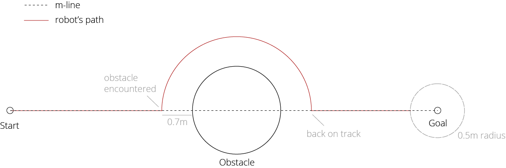
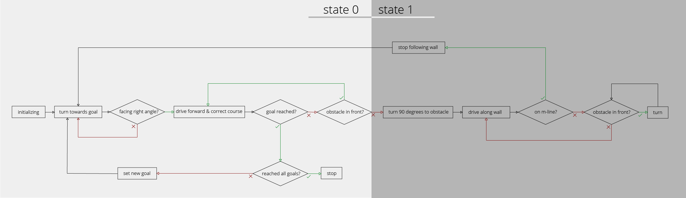
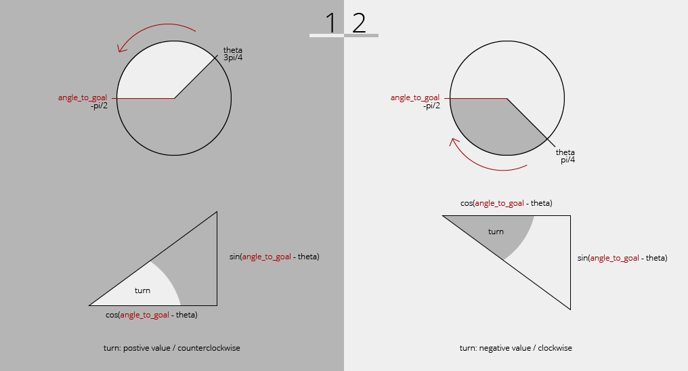

# readme 
## documentation AMR WS18/19


The task of the final project was to develop code which enables the robot to navigate to three goal points one after another without having any collisions with obstacles. 
The robot has local knowledge of the world that is to say it does not know the position and shape of possible obstacles. 
The information it uses is data published by a 360° Laserscan and the gazebo/modelstates topic which offers the robots current position and orientation information. 
The coordinates of the goals are provided by the goal_publisher.

This repository contains several files in the src folder. Most of them contain code for a smaller task and are like a backup. 
The file that actually contains the final code is **robot.py**. 
The launch file which is used to run the code is **start.launch** in the launch folder.


### 1.) Getting started
To get the project running some prerequisites must be fulfilled.

Start ros using with ```roscore```
    
After using the command roscore, gazebo should be stared with an empty world.
	```roslaunch turtlebot3_gazebo turtlebot3_empty_world.launch```
	
After this the arena can be spawned by using the command
    ```rosrun gazebo_ros spawn_model -file ~/catkin_ws/src/me-161731_tier3/mini_project_bachelors/model.sdf -sdf -model mini_project```
    
To finally start the code, we run the command
    ```me_161731_prj start.launch```
    
The launchfile will automatically launch goalpublisher and disttracker. Furtermore the LaserScan and gazebo/Modelstates topics have to be available.
The robot will now start to navigate to the goal point. 

Type 
	```python rosservice call /gazebo/reset_world```
to reset the world if needed.


### 2.) Algorithm description
The algorithm implemented in this project is called **Bug 2**.
In general, like with other bug algorithms, it can be devided into **2 modes**:
1. Drive straight towards goalpoint
2. Navigate around obstacle by following its walls

The robot can switch between these two modes. 
At the beginning the robot starts at mode 1. If an obstacle which blocks the robot's way is detected,
the robot will switch to mode 2 and start circumnavigating the obstacle by following its walls until a certain exit condition is met and modes are switched again.

The distinctive feature of the Bug 2 is its exit condition. 
To decide when to stop following the wall and start driving straight towards the goal again, 
it makes use of a special line running trhough the robots starting position and the goal position. In the following this line will be referred to as the m-line.
If the robot is heading straight towards the goal it moves along this m-line. The m-line is left, as soon as an obstacle is encountered and the robot starts following the borders of the object.
The robot should switch to mode 1 if it intersects this m-line again while circumnavigating the obstacle.



### 3.) Implementation
The robot uses an object oriented code with only one class which is Robot().

This class implements a number of member variables that keep track of relevant information like all all three goals, the position of the next goal, the current start point, 
the robot's position, the Laserscan data as well as some variables that help the robot switch between different states.

The main method that is executed in a loop until the programm is shutdown is run(). 
This method contains the main program structure /logic and calls other methods of the class as needed.
In the last line of the run()-method, the publisher pubVel publishes the most recent values of the speed-Twistmessage so the robot actually moves.

**Publishers/Subscribers**

The node subscribes to two Publishers constantely:

The first subscriber is for the **/gazebo/model_states** topic. Whenever a message is received the callback self.modelstates() will be executed.
```python 
def modelStates (self, msg):
    self.pos.x = msg.pose[1].position.x
    self.pos.y = msg.pose[1].position.y
    rot_q = msg.pose[1].orientation
    (roll, pitch, self.theta) = euler_from_quaternion([rot_q.x, rot_q.y, rot_q.z, rot_q.w])
```
This callback only gets the x and y values for the robot's positon as well as theta and saves them to member variables. 
self.theta represents the yaw of the robot and is saved in the euler format after converting it from the quaternion format which the publisher uses.

The second subscriber is for the **/scan** topic which returns all the individual values from the Laserscanner in one message.
```python 
def callbackLaser (self, msg):
    self.regions = {
        'frontLeft': min(min(msg.ranges[0:14]), 99),            # 99 if out of range
        'frontRight': min(min(msg.ranges[344:359]), 99),,
        'farRight': min(min(msg.ranges[271:276]), 99),
        'farLeft': min(min(msg.ranges[84:89]),99)
    }
```
For my code I did not consider all the laserbeams. I only use some defined regions, respectively I only save the smallest distance of a certain range of laser beams/reagion.
frontLeft and frontRight are used to check for obstacles right in front of the robot.
farLeft and farRight are two regions at the sides of the robot which are used to follow walls.
If the value inf is returned, 99 is used instead.

Furthermore the robot subscribes to the **/goals** topic which publishes the coordinates of the three goal points once. 
It waits for the first message to be publsished and after it has received it, will not call any callbacks as there is no new information to be expected.

There is also one Publisher (**/cmd_vel**) which is used to control the movement of the robot. 
It uses a Twist message named speed which has the two components linear.x and angular.z which are changed through the code. 

**Initiating**

At the very beginning the Robot class is initiated which sets all the important variables and also introduces the Subscribers and the Publisher mentioned above.

After that the programm is waiting for the goal message to be published once.
```python 
msg = rospy.wait_for_message('goals', PointArray)
```
After this, the goals get set and the robot enters the while loop containing its main method.



**Move to goal (state 0)**

If the member variable self.state is 0, the move to goal behaviour is active.

Before moving/continuing to move, the robot checks if it has already reached the goal which is true if the distance is less than 0.5m and there is no obstacle blocking the way.
If the robot has reached a current goal, it stops and the method self.goal_reached() is called.
The function checks if there is a next goal or if the robot has already reached all three and based on that decides to stop or move to another goal.
The function prepares the robot for the next_goal by resetting move_forward and changing the currentStart to currentPosition so that the m-line can be calculated correctly.
```python     
def goal_reached(self):
        self.currentStart.x = self.pos.x
        self.currentStart.y = self.pos.y
        self.move_forward = False

        if self.currentGoal + 1 < self.noGoals:
            print "I reached goal nr " + str(self.currentGoal + 1)
            self.set_goal()
        else:
            print "hoooray...I reached all goal points"
```
The method set_goal() updates the currentgoal to the next one of the goal array.


Before the robot can move towards the goal point, it first has to get the right direction. 
The differences of the x and y coordinates of the the current position and the goal are used to calculate the desired angle using simple trignometry.
```python 
delta_x = self.goal.x - self.pos.x     #distance robot to goal in x
delta_y = self.goal.y - self.pos.y    #distance robot to goal in y
self.angle_to_goal = atan2 (delta_y, delta_x)
```
To see if the robot has the right direction this value is contantely compared to the self.theta of the robot. 
If the difference of the two angles is smaller than 0.2, the direction seems to be good enough. This threshold is used because the robot cannot be 100% accurate. 
I use abs() as positive and negative angles are possible.

Once the robot got the right angle, linear movement is activated additionaly to the turning which deals with any deviation that might occur and corrects the course.
The angular velocity depends on the two angles. If they are further apart, the velocity will be higher and slower if we get closer to the desired angle so we do not overshoot it.

Furthermore the robot checks if it has to turn less if it turns clockwise or counterclockwise by comparing the two angles once again.
turn is negative in cases if it is better to turn clockwise which is perfect as a negative angular.z also represents counterclockwise rotation.
The picture below shows two possible scenarios. In 1 it is better to turn counterclockwise, while in 2 clockwise rotation is more suitable.
```python 
turn = atan2(sin(angle_to_goal-self.theta), cos(angle_to_goal-self.theta))
...
speed.angular.z = 0.2 * turn
```




Similar to the turning, the robot moves relatively to the distance to the goal but at a maximum of 0.5m/s and a minimum of 0.4m/s. The distance is calculated with the help of the Pythagorean Theorem.

The robot constantely checks for obstacles in front of it. 
It therefore uses the self.regions mentioned above. 
The distance to an obstacle has to be less than 0.7m for the robot to react to it and change modes.
The robot also saves the smallest distance to the obstacle which will be used in a short while for turning in state 1.
```python
if self.regions['frontLeft'] < 0.7 or self.regions['frontRight'] < 0.7:
    print "there seems to be an obstacle"
    self.nearest = min(self.regions['frontLeft'], self.regions['frontRight'])
    self.move_forward = False
    self.state = 1      # --> switch to new state
```

**Circumnavigate obstacle (state 1)**

State 1 is subdivided into a big if-elif where the robot checks if the variable following_wall is true or false. When first starting, this variable is false.
Which means the robot is not following a wall yet and e.g. has to turn first.

In the respective if-block the robot turns until its alignment is about at an angle of 90 degrees to the object, so the robot has the obstacle pretty good at it's side.. 
It does this by turning with an angular.z of 0.7 until the value of self.regions['farRight'] is less then 0.03 bigger or smaller than the value of self.nearest, which we have saved before switching modes. 
The position where this obstacle occurred is saved into self.obstacleEncountered which will later be used to make sure, 
the robot does drive some distance and not recognize its position as on the m-line without moving and gets trapped in a loop. 

```python
if self.following_wall == False:
    if abs(self.regions['farRight'] - self.nearest <= 0.03):
        self.obstacleEncountered.x = self.pos.x
        self.obstacleEncountered.y = self.pos.y

        speed.linear.x = 0.3
        speed.angular.z = 0.0
        self.following_wall = True
    else:
        speed.linear.x = 0.0
         speed.angular.z = 0.7
```

The robot now starts to drive forward and switches into the wall_following sub-mode.

If the robot is following the wall it calls two functions right at the beginning.
The method isBetweenStartAndGoal() implements the logic of an imaginary m-line with the help of vectors.
```python
def isBetweenStartAndGoal(self):
    # vector from current position to start
    dx1 = self.pos.x - self.currentStart.x
    dy1 = self.pos.y - self.currentStart.y

    # vector from goal to start
    dx2 = self.goal.x - self.currentStart.x
    dy2 = self.goal.y - self.currentStart.y

    cross = dx1 * dy2 - dy1 * dx2

    if cross < 0.0 + 0.3 and cross > 0.0 - 0.3:         #if crossproduct is 0 (+/- 0.1), the two vectors are collinear/in one line
        self.back_on_track = True
    else:
        self.back_on_track = False
```
The idea is that if the robot is back on the m-line all 3 points (currentStart, currentPosition, currentGoal) lie on it. 
To check this I work as if I had two vectors. 

Vector 1 is the one from currentStart to currentPosition. dx is representing the x component of this vector and dy the y component.

Vector 2 is the vector from currentStart to currentGoal.

We can use a simple crossproduct to check if both vectors are collinear. If the crossproduct is 0, this is the case. 
Again we add a generous threshold of +/-0.3m because the line does not have to be too precise. 
We set the variable back_on_track according to the result of this check.

The method drove_some_distance is very simple and only validates the result of the previous method.
We use a comparison of the coordinates of the point where the obstacle was encountered and the position the robot is at right now to make sure the robot does not instantly switch modes
as the obstacleEncountered Point also fulfills the condition of being on the m-line.
```python
def drove_some_distance(self):
        self.dist = sqrt(pow(self.pos.x - self.obstacleEncountered.x, 2) + pow(self.pos.y - self.obstacleEncountered.y,2))
```

Back in the run() method the robot continues with checking if there is an obstacle in front of it. If so, it turns until the regions
frontLeft'] and self.regions['frontRight'] are bigger than 0.7m.

If the front is free the robot checks if it has reached a valid exit point and should switch back to state 0. 
```python
if self.back_on_track == True and self.dist > 1:
                        print "I'm back on track"
                        self.state = 0  # --> switch to new state
                        self.following_wall = False#
```
Otherwise it drives along the wall, adjusting its angular.z to keep a certain distance range of about 0.2m to the wall it is following.
To do this, the robot changes its angular.z relative to the current distance.
```python
else:
    speed.angular.z = 0.9 * (0.2-self.regions['farRight'])
    speed.linear.x = 0.3
```

### 4.) Problems & Solutions
A problem that accompanied me through the project was the one with turning towards the goalpoint accurately and efficiently. 
For a long time the robot got the angle right in some cases but not others. It either turned too fast which led to overshooting or too slow which led to the robot to constantely stop after a few centimeters to correct its path.
When overshooting or if the angle_to_goal was very near on the right side of the robot, it had to turn very far counterclockwise to get there instead of understanding when to turn which way. 
Furthermore there were some dificulties with the turning direction and its speed as the angles on the robots left side were labeled 0 to pi and 0 to -pi on the right side instead of continous angles from 0 to 2pi.
This problem was solved as already mentioned above.
